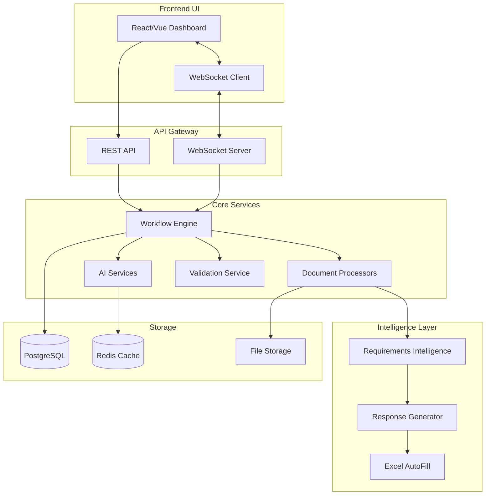

# 🎯 Plan d'Implémentation Scorpius Project - Automatisation Complète des Réponses aux AO

## 📊 Analyse de l'État Actuel

### Forces Existantes à Exploiter
- ✅ **Architecture RAG fonctionnelle** avec Mistral + Redis + embeddings
- ✅ **Pipeline de traitement PDF** avec PyMuPDF et chunking intelligent
- ✅ **API RESTful structurée** (FastAPI) avec auth JWT
- ✅ **Base de données relationnelle** avec 9 tables prêtes
- ✅ **Services d'analyse** : requirements_extractor, capability_matcher
- ✅ **Cache d'embeddings Redis** (168h TTL, 100% hit rate sur re-runs)

### Gaps à Combler
- ❌ Pas de support Excel/Word/PPT natif
- ❌ Pas de générateur de documents de réponse
- ❌ Pas d'API de workflow orchestré
- ❌ Pas de système de templates pour BPU/DPGF/DQE
- ❌ Pas de validation manuelle intégrée pour éléments visuels

## 🚀 PHASE 1 : Extension Multi-Format (2 semaines)

### Objectif
Étendre le système existant pour traiter tous les formats d'un AO

### 1.1 Nouveaux Processors

```python
# src/processors/excel_processor.py
from typing import Dict, Any, List
from openpyxl import load_workbook
from src.processors.base import DocumentProcessor, ProcessingResult

class ExcelProcessor(DocumentProcessor):
    """Processeur pour fichiers Excel (BPU, DPGF, DQE)."""

    TEMPLATE_TYPES = {
        'BPU': ['bordereau', 'prix', 'unitaire'],
        'DPGF': ['decomposition', 'prix', 'global'],
        'DQE': ['detail', 'quantitatif', 'estimatif']
    }

    async def process(self, file_path: str, options: Dict[str, Any]) -> ProcessingResult:
        """Extract structure and fields from Excel templates."""
        wb = load_workbook(file_path, data_only=False)

        template_type = self._detect_template_type(wb)
        structure = self._extract_structure(wb)
        formulas = self._extract_formulas(wb)
        required_fields = self._identify_required_fields(wb)

        return ProcessingResult(
            raw_text=None,  # Excel n'a pas de texte brut
            structured_content={
                'template_type': template_type,
                'structure': structure,
                'formulas': formulas,
                'required_fields': required_fields,
                'sheets': [sheet.title for sheet in wb.worksheets]
            },
            metadata={
                'processor': 'ExcelProcessor',
                'template_type': template_type,
                'fillable_cells': len(required_fields)
            }
        )

    def _detect_template_type(self, workbook) -> str:
        """Detect if BPU, DPGF or DQE based on content."""
        first_sheet_content = str(workbook.worksheets[0].cell(1, 1).value).lower()

        for template_type, keywords in self.TEMPLATE_TYPES.items():
            if any(keyword in first_sheet_content for keyword in keywords):
                return template_type

        return 'UNKNOWN'

    def _identify_required_fields(self, workbook) -> List[Dict]:
        """Identify cells that need to be filled by the bidder."""
        required_fields = []

        for sheet in workbook.worksheets:
            for row in sheet.iter_rows():
                for cell in row:
                    # Detect empty cells with borders or specific formatting
                    if (cell.value is None and
                        cell.border and
                        (cell.border.bottom or cell.border.right)):
                        required_fields.append({
                            'sheet': sheet.title,
                            'cell': cell.coordinate,
                            'row': cell.row,
                            'column': cell.column,
                            'format': cell.number_format
                        })

        return required_fields
```

```python
# src/processors/word_processor.py
from docx import Document
from src.processors.base import DocumentProcessor, ProcessingResult

class WordProcessor(DocumentProcessor):
    """Processeur pour documents Word."""

    async def process(self, file_path: str, options: Dict[str, Any]) -> ProcessingResult:
        """Extract text and structure from Word documents."""
        doc = Document(file_path)

        # Extract text with structure preservation
        structured_text = []
        tables_data = []

        for element in doc.element.body:
            if element.tag.endswith('p'):
                para = element.text
                style = element.style.name if hasattr(element, 'style') else 'Normal'
                structured_text.append({
                    'type': 'paragraph',
                    'content': para,
                    'style': style
                })
            elif element.tag.endswith('tbl'):
                # Extract table data
                table_data = self._extract_table(element)
                tables_data.append(table_data)
                structured_text.append({
                    'type': 'table',
                    'data': table_data
                })

        return ProcessingResult(
            raw_text='\n'.join([item['content'] for item in structured_text if item['type'] == 'paragraph']),
            structured_content={
                'elements': structured_text,
                'tables': tables_data,
                'styles': list(set([item.get('style') for item in structured_text]))
            },
            metadata={
                'processor': 'WordProcessor',
                'paragraph_count': len([i for i in structured_text if i['type'] == 'paragraph']),
                'table_count': len(tables_data)
            }
        )
```

```python
# src/processors/powerpoint_processor.py
from pptx import Presentation
import re
from typing import Dict, Any, List

class PowerPointProcessor(DocumentProcessor):
    """Processeur pour PowerPoint avec détection de planning."""

    PLANNING_INDICATORS = [
        'planning', 'gantt', 'calendrier', 'échéancier',
        'phases', 'jalons', 'milestones', 'timeline'
    ]

    async def process(self, file_path: str, options: Dict[str, Any]) -> ProcessingResult:
        """Extract text from PowerPoint, flag visual planning elements."""
        prs = Presentation(file_path)

        slides_content = []
        visual_elements_detected = []

        for slide_num, slide in enumerate(prs.slides, 1):
            slide_text = []
            has_visual_planning = False

            # Extract text from shapes
            for shape in slide.shapes:
                if hasattr(shape, "text"):
                    text = shape.text.strip()
                    if text:
                        slide_text.append(text)
                        # Check for planning keywords
                        if any(indicator in text.lower() for indicator in self.PLANNING_INDICATORS):
                            has_visual_planning = True

                # Detect charts/diagrams (likely Gantt)
                if shape.has_chart or shape.has_table:
                    visual_elements_detected.append({
                        'slide': slide_num,
                        'type': 'chart' if shape.has_chart else 'table',
                        'warning': 'Visual element detected - manual review required'
                    })
                    has_visual_planning = True

            slides_content.append({
                'slide_number': slide_num,
                'text_content': '\n'.join(slide_text),
                'has_visual_planning': has_visual_planning,
                'shape_count': len(slide.shapes)
            })

        return ProcessingResult(
            raw_text='\n\n'.join([f"Slide {s['slide_number']}:\n{s['text_content']}" for s in slides_content]),
            structured_content={
                'slides': slides_content,
                'visual_elements': visual_elements_detected,
                'likely_contains_planning': any(s['has_visual_planning'] for s in slides_content)
            },
            metadata={
                'processor': 'PowerPointProcessor',
                'slide_count': len(prs.slides),
                'requires_manual_review': len(visual_elements_detected) > 0,
                'planning_detected': any(s['has_visual_planning'] for s in slides_content)
            }
        )
```

### 1.2 API Endpoints pour Multi-Format

```python
# src/api/v1/endpoints/tender_analysis.py
from fastapi import APIRouter, UploadFile, File, HTTPException, Depends
from typing import List, Dict, Any
import asyncio
from uuid import UUID

router = APIRouter(prefix="/api/v1/tender", tags=["tender-analysis"])

@router.post("/analyze-complete")
async def analyze_complete_tender(
    tender_id: UUID,
    files: List[UploadFile] = File(...),
    current_user: User = Depends(get_current_user),
    db: AsyncSession = Depends(get_db)
):
    """Analyse complète d'un appel d'offres multi-documents."""

    # 1. Process all files in parallel
    processing_tasks = []
    for file in files:
        if file.filename.endswith('.pdf'):
            processor = PDFProcessor()
        elif file.filename.endswith(('.xlsx', '.xls')):
            processor = ExcelProcessor()
        elif file.filename.endswith('.docx'):
            processor = WordProcessor()
        elif file.filename.endswith('.pptx'):
            processor = PowerPointProcessor()
        else:
            continue

        processing_tasks.append(processor.process(file))

    results = await asyncio.gather(*processing_tasks)

    # 2. Aggregate analysis
    analysis = {
        'tender_id': tender_id,
        'documents_analyzed': len(results),
        'pdf_documents': [],
        'excel_templates': [],
        'word_documents': [],
        'powerpoint_files': [],
        'total_requirements': 0,
        'manual_review_needed': []
    }

    for result in results:
        if result.metadata['processor'] == 'PDFProcessor':
            analysis['pdf_documents'].append(result)
        elif result.metadata['processor'] == 'ExcelProcessor':
            analysis['excel_templates'].append({
                'type': result.structured_content['template_type'],
                'fillable_fields': len(result.structured_content['required_fields']),
                'structure': result.structured_content['structure']
            })
        elif result.metadata['processor'] == 'PowerPointProcessor':
            if result.metadata.get('requires_manual_review'):
                analysis['manual_review_needed'].append({
                    'file': result.metadata.get('filename'),
                    'reason': 'Visual planning elements detected',
                    'slides': result.structured_content['visual_elements']
                })

    # 3. Extract all requirements
    requirements_service = RequirementsExtractorService()
    all_requirements = await requirements_service.extract_from_multiple(results)
    analysis['total_requirements'] = len(all_requirements)
    analysis['requirements'] = all_requirements

    # 4. Generate GO/NO-GO score
    scoring_service = TenderScoringService()
    analysis['go_no_go_score'] = await scoring_service.calculate_score(analysis)

    # 5. Store in database
    await tender_repository.store_analysis(db, tender_id, analysis, current_user.id)

    return {
        'status': 'success',
        'analysis': analysis,
        'next_steps': generate_next_steps(analysis)
    }
```

## 🤖 PHASE 2 : Intelligence des Exigences (3 semaines)

### 2.1 Service de Mapping Exigences-Réponses

```python
# src/services/requirements_intelligence.py
from typing import List, Dict, Any, Optional
from dataclasses import dataclass
from src.services.ai.mistral_service import MistralService

@dataclass
class RequirementResponse:
    requirement_id: str
    requirement_text: str
    response_type: str  # 'text', 'number', 'price', 'date', 'boolean', 'document_reference'
    suggested_response: Optional[str]
    confidence: float
    source_references: List[str]
    validation_rules: Dict[str, Any]

class RequirementsIntelligenceService:
    """Service intelligent pour mapper exigences et générer des réponses."""

    def __init__(self, mistral_service: MistralService):
        self.mistral = mistral_service
        self.response_templates = self._load_response_templates()

    async def analyze_requirement(
        self,
        requirement: str,
        context: Dict[str, Any],
        company_profile: Dict[str, Any]
    ) -> RequirementResponse:
        """Analyse une exigence et propose une réponse."""

        # 1. Classify requirement type
        req_type = await self._classify_requirement(requirement)

        # 2. Search for similar past responses
        similar_responses = await self._search_similar_responses(
            requirement,
            company_profile.get('past_bids', [])
        )

        # 3. Generate response based on context
        if req_type == 'certification':
            response = await self._handle_certification_requirement(
                requirement,
                company_profile.get('certifications', [])
            )
        elif req_type == 'technical':
            response = await self._handle_technical_requirement(
                requirement,
                company_profile.get('technical_capabilities', {}),
                similar_responses
            )
        elif req_type == 'financial':
            response = await self._handle_financial_requirement(
                requirement,
                company_profile.get('financial_data', {}),
                context.get('excel_templates', [])
            )
        elif req_type == 'deadline':
            response = await self._handle_deadline_requirement(
                requirement,
                context.get('planning', {})
            )
        else:
            response = await self._generate_generic_response(
                requirement,
                similar_responses
            )

        return response

    async def _classify_requirement(self, requirement: str) -> str:
        """Classify the type of requirement."""
        prompt = f"""
        Classifie cette exigence d'appel d'offres dans une des catégories suivantes:
        - certification (ISO, labels, certifications)
        - technical (capacités techniques, méthodologie)
        - financial (prix, garanties financières)
        - deadline (délais, planning, échéances)
        - administrative (documents administratifs)
        - reference (références clients)
        - other

        Exigence: {requirement}

        Réponds uniquement avec le type.
        """

        response = await self.mistral.generate(prompt)
        return response.strip().lower()

    async def _handle_financial_requirement(
        self,
        requirement: str,
        financial_data: Dict,
        excel_templates: List[Dict]
    ) -> RequirementResponse:
        """Handle financial requirements with Excel template mapping."""

        # Find relevant Excel template
        relevant_template = None
        for template in excel_templates:
            if any(keyword in requirement.lower() for keyword in ['bpu', 'dpgf', 'dqe', 'prix']):
                relevant_template = template
                break

        if relevant_template:
            return RequirementResponse(
                requirement_id=generate_id(),
                requirement_text=requirement,
                response_type='price',
                suggested_response=None,  # Will be filled in Excel
                confidence=0.9,
                source_references=[f"Excel template: {relevant_template['type']}"],
                validation_rules={
                    'template': relevant_template['type'],
                    'required_fields': relevant_template['fillable_fields'],
                    'format': 'excel_submission'
                }
            )

        # Generate textual financial response
        suggested = f"Notre proposition financière détaillée est fournie dans le document {relevant_template['type'] if relevant_template else 'BPU'} joint."

        return RequirementResponse(
            requirement_id=generate_id(),
            requirement_text=requirement,
            response_type='price',
            suggested_response=suggested,
            confidence=0.7,
            source_references=['company_financial_data'],
            validation_rules={'requires_excel': True}
        )
```

### 2.2 API de Validation et Suggestions

```python
# src/api/v1/endpoints/requirements.py
from fastapi import APIRouter, HTTPException, Depends
from typing import List, Dict, Any
from uuid import UUID

router = APIRouter(prefix="/api/v1/requirements", tags=["requirements"])

@router.post("/validate-responses")
async def validate_requirement_responses(
    tender_id: UUID,
    responses: List[Dict[str, Any]],
    current_user: User = Depends(get_current_user),
    db: AsyncSession = Depends(get_db)
):
    """Valide les réponses aux exigences et suggère des améliorations."""

    validation_service = RequirementValidationService()
    intelligence_service = RequirementsIntelligenceService()

    results = []

    for response in responses:
        # 1. Validate completeness
        validation = await validation_service.validate(
            response['requirement_id'],
            response['response_text'],
            response.get('attachments', [])
        )

        # 2. Suggest improvements if needed
        if validation['score'] < 0.8:
            suggestions = await intelligence_service.improve_response(
                response['requirement_id'],
                response['response_text'],
                validation['issues']
            )
            validation['suggestions'] = suggestions

        # 3. Check cross-references
        cross_refs = await validation_service.check_cross_references(
            response,
            responses  # All responses for consistency check
        )
        validation['cross_references'] = cross_refs

        results.append({
            'requirement_id': response['requirement_id'],
            'validation': validation,
            'status': 'complete' if validation['score'] >= 0.8 else 'needs_revision'
        })

    # 4. Global consistency check
    global_check = await validation_service.check_global_consistency(responses)

    return {
        'tender_id': tender_id,
        'individual_validations': results,
        'global_validation': global_check,
        'ready_to_submit': all(r['status'] == 'complete' for r in results) and global_check['passed']
    }

@router.post("/auto-fill-excel/{tender_id}")
async def auto_fill_excel_templates(
    tender_id: UUID,
    template_type: str,  # BPU, DPGF, or DQE
    current_user: User = Depends(get_current_user),
    db: AsyncSession = Depends(get_db)
):
    """Auto-remplit les templates Excel avec les données de l'entreprise."""

    # 1. Get tender analysis
    tender = await tender_repository.get(db, tender_id)
    if not tender:
        raise HTTPException(status_code=404, detail="Tender not found")

    # 2. Get company data
    company_profile = await company_repository.get_profile(db, current_user.company_id)

    # 3. Get Excel template structure
    excel_template = next(
        (t for t in tender.excel_templates if t['type'] == template_type),
        None
    )

    if not excel_template:
        raise HTTPException(status_code=404, detail=f"Template {template_type} not found")

    # 4. Auto-fill service
    auto_fill_service = ExcelAutoFillService()
    filled_data = await auto_fill_service.fill_template(
        template=excel_template,
        company_data=company_profile,
        tender_context=tender
    )

    # 5. Generate filled Excel file
    output_file = await auto_fill_service.generate_excel(
        template_structure=excel_template['structure'],
        filled_data=filled_data
    )

    return {
        'status': 'success',
        'template_type': template_type,
        'filled_cells': len(filled_data),
        'download_url': f"/api/v1/downloads/{output_file['id']}",
        'validation_warnings': filled_data.get('warnings', [])
    }
```

## 🔄 PHASE 3 : Orchestration Complète (4 semaines)

### 3.1 Workflow Engine

```python
# src/services/workflow_engine.py
from enum import Enum
from typing import Dict, Any, List, Optional
from dataclasses import dataclass
import asyncio

class WorkflowStep(Enum):
    UPLOAD_DOCUMENTS = "upload_documents"
    ANALYZE_REQUIREMENTS = "analyze_requirements"
    EXTRACT_TEMPLATES = "extract_templates"
    GENERATE_RESPONSES = "generate_responses"
    FILL_EXCEL = "fill_excel"
    VALIDATE_RESPONSES = "validate_responses"
    MANUAL_REVIEW = "manual_review"
    GENERATE_SUBMISSION = "generate_submission"
    FINAL_CHECK = "final_check"

@dataclass
class WorkflowState:
    tender_id: str
    current_step: WorkflowStep
    completed_steps: List[WorkflowStep]
    pending_manual_reviews: List[Dict[str, Any]]
    data: Dict[str, Any]
    errors: List[str]
    warnings: List[str]
    progress_percentage: float

class BidWorkflowEngine:
    """Orchestrateur du workflow complet de réponse à AO."""

    def __init__(self):
        self.workflows: Dict[str, WorkflowState] = {}
        self.step_handlers = self._initialize_handlers()

    async def start_workflow(
        self,
        tender_id: str,
        uploaded_files: List[Dict],
        company_profile: Dict
    ) -> WorkflowState:
        """Démarre un nouveau workflow de réponse."""

        state = WorkflowState(
            tender_id=tender_id,
            current_step=WorkflowStep.UPLOAD_DOCUMENTS,
            completed_steps=[],
            pending_manual_reviews=[],
            data={
                'files': uploaded_files,
                'company_profile': company_profile,
                'analysis': {},
                'responses': {},
                'validations': {}
            },
            errors=[],
            warnings=[],
            progress_percentage=0.0
        )

        self.workflows[tender_id] = state

        # Start async execution
        asyncio.create_task(self._execute_workflow(state))

        return state

    async def _execute_workflow(self, state: WorkflowState):
        """Exécute le workflow étape par étape."""

        workflow_sequence = [
            WorkflowStep.ANALYZE_REQUIREMENTS,
            WorkflowStep.EXTRACT_TEMPLATES,
            WorkflowStep.GENERATE_RESPONSES,
            WorkflowStep.FILL_EXCEL,
            WorkflowStep.VALIDATE_RESPONSES,
            WorkflowStep.MANUAL_REVIEW,
            WorkflowStep.GENERATE_SUBMISSION,
            WorkflowStep.FINAL_CHECK
        ]

        for step in workflow_sequence:
            try:
                state.current_step = step
                handler = self.step_handlers[step]

                # Execute step
                result = await handler(state)

                # Update state
                state.completed_steps.append(step)
                state.data[step.value] = result
                state.progress_percentage = (len(state.completed_steps) / len(workflow_sequence)) * 100

                # Check for manual intervention needed
                if step == WorkflowStep.MANUAL_REVIEW and state.pending_manual_reviews:
                    await self._wait_for_manual_review(state)

                # Notify via WebSocket
                await self._notify_progress(state)

            except Exception as e:
                state.errors.append(f"Error in {step.value}: {str(e)}")
                await self._notify_error(state)
                break

    async def _analyze_requirements_handler(self, state: WorkflowState) -> Dict:
        """Analyse tous les documents et extrait les exigences."""

        analyzer = CompleteTenderAnalyzer()
        analysis = await analyzer.analyze_all(state.data['files'])

        # Flag manual review items
        if analysis.get('powerpoint_planning_detected'):
            state.pending_manual_reviews.append({
                'type': 'planning_visual',
                'files': analysis['powerpoint_files'],
                'message': 'Des éléments visuels de planning ont été détectés'
            })

        return analysis

    async def _fill_excel_handler(self, state: WorkflowState) -> Dict:
        """Remplit automatiquement les templates Excel."""

        excel_filler = ExcelAutoFillService()
        filled_templates = {}

        for template in state.data['analysis']['excel_templates']:
            filled = await excel_filler.fill_template(
                template=template,
                company_data=state.data['company_profile'],
                requirements=state.data['responses']
            )
            filled_templates[template['type']] = filled

            # Flag cells needing manual review
            if filled.get('uncertain_cells'):
                state.pending_manual_reviews.append({
                    'type': 'excel_validation',
                    'template': template['type'],
                    'cells': filled['uncertain_cells'],
                    'message': f"Vérification requise pour {len(filled['uncertain_cells'])} cellules"
                })

        return filled_templates

    async def resume_after_manual_review(
        self,
        tender_id: str,
        review_results: Dict[str, Any]
    ):
        """Reprend le workflow après validation manuelle."""

        state = self.workflows.get(tender_id)
        if not state:
            raise ValueError(f"No workflow found for tender {tender_id}")

        # Apply manual review results
        state.data['manual_reviews'] = review_results
        state.pending_manual_reviews = []

        # Resume workflow
        await self._execute_workflow(state)
```

### 3.2 API WebSocket pour Suivi Temps Réel

```python
# src/api/v1/endpoints/workflow_ws.py
from fastapi import APIRouter, WebSocket, WebSocketDisconnect, Depends
from typing import Dict
import json

router = APIRouter()

class WorkflowConnectionManager:
    def __init__(self):
        self.active_connections: Dict[str, List[WebSocket]] = {}

    async def connect(self, websocket: WebSocket, tender_id: str):
        await websocket.accept()
        if tender_id not in self.active_connections:
            self.active_connections[tender_id] = []
        self.active_connections[tender_id].append(websocket)

    def disconnect(self, websocket: WebSocket, tender_id: str):
        self.active_connections[tender_id].remove(websocket)

    async def send_progress(self, tender_id: str, message: Dict):
        if tender_id in self.active_connections:
            for connection in self.active_connections[tender_id]:
                await connection.send_json(message)

manager = WorkflowConnectionManager()

@router.websocket("/ws/workflow/{tender_id}")
async def workflow_progress(
    websocket: WebSocket,
    tender_id: str,
    current_user: User = Depends(get_current_user_ws)
):
    """WebSocket pour suivre la progression du workflow en temps réel."""

    await manager.connect(websocket, tender_id)

    try:
        # Send initial state
        workflow_engine = BidWorkflowEngine()
        state = workflow_engine.get_state(tender_id)

        await websocket.send_json({
            'type': 'initial_state',
            'data': {
                'current_step': state.current_step.value,
                'progress': state.progress_percentage,
                'completed_steps': [s.value for s in state.completed_steps],
                'pending_reviews': state.pending_manual_reviews,
                'errors': state.errors,
                'warnings': state.warnings
            }
        })

        # Keep connection alive and handle messages
        while True:
            data = await websocket.receive_text()
            message = json.loads(data)

            if message['type'] == 'manual_review_complete':
                await workflow_engine.resume_after_manual_review(
                    tender_id,
                    message['review_data']
                )
            elif message['type'] == 'pause_workflow':
                await workflow_engine.pause(tender_id)
            elif message['type'] == 'resume_workflow':
                await workflow_engine.resume(tender_id)

    except WebSocketDisconnect:
        manager.disconnect(websocket, tender_id)
```

### 3.3 API de Génération Finale

```python
# src/api/v1/endpoints/submission.py
from fastapi import APIRouter, HTTPException, Depends
from typing import List, Dict, Any
from uuid import UUID
import zipfile
import io

router = APIRouter(prefix="/api/v1/submission", tags=["submission"])

@router.post("/generate/{tender_id}")
async def generate_final_submission(
    tender_id: UUID,
    include_documents: List[str],
    current_user: User = Depends(get_current_user),
    db: AsyncSession = Depends(get_db)
):
    """Génère le dossier de réponse complet à soumettre."""

    # 1. Get workflow state
    workflow_engine = BidWorkflowEngine()
    state = workflow_engine.get_state(str(tender_id))

    if not state or state.current_step != WorkflowStep.FINAL_CHECK:
        raise HTTPException(
            status_code=400,
            detail="Workflow not ready for submission generation"
        )

    # 2. Generate all documents
    generator = SubmissionGenerator()

    documents = []

    # Technical response document
    if 'technical_response' in include_documents:
        tech_doc = await generator.generate_technical_response(
            requirements=state.data['requirements'],
            responses=state.data['responses'],
            company_profile=state.data['company_profile']
        )
        documents.append(tech_doc)

    # Financial documents (filled Excel)
    if 'financial_response' in include_documents:
        for template_type in ['BPU', 'DPGF', 'DQE']:
            if template_type in state.data['filled_excel']:
                documents.append(state.data['filled_excel'][template_type])

    # Administrative documents
    if 'administrative_docs' in include_documents:
        admin_docs = await generator.compile_administrative_documents(
            company_profile=state.data['company_profile']
        )
        documents.extend(admin_docs)

    # 3. Create ZIP archive
    zip_buffer = io.BytesIO()
    with zipfile.ZipFile(zip_buffer, 'w', zipfile.ZIP_DEFLATED) as zip_file:
        for doc in documents:
            zip_file.writestr(doc['filename'], doc['content'])

    # 4. Generate submission checklist
    checklist = await generator.generate_submission_checklist(
        tender_requirements=state.data['requirements'],
        included_documents=documents
    )

    # 5. Store submission record
    submission = await submission_repository.create(
        db,
        tender_id=tender_id,
        user_id=current_user.id,
        documents=documents,
        checklist=checklist
    )

    return {
        'submission_id': submission.id,
        'status': 'ready',
        'documents_count': len(documents),
        'checklist': checklist,
        'download_url': f"/api/v1/downloads/submission/{submission.id}",
        'validation_summary': {
            'all_requirements_addressed': checklist['all_requirements_met'],
            'missing_items': checklist.get('missing_items', []),
            'warnings': state.warnings
        }
    }

@router.get("/preview/{tender_id}")
async def preview_submission(
    tender_id: UUID,
    current_user: User = Depends(get_current_user)
):
    """Aperçu du dossier de soumission avant génération finale."""

    workflow_engine = BidWorkflowEngine()
    state = workflow_engine.get_state(str(tender_id))

    if not state:
        raise HTTPException(status_code=404, detail="Workflow not found")

    preview = {
        'tender_id': tender_id,
        'completion_status': state.progress_percentage,
        'documents_ready': [],
        'documents_pending': [],
        'manual_reviews_pending': state.pending_manual_reviews,
        'validation_status': {}
    }

    # List ready documents
    if state.data.get('responses'):
        preview['documents_ready'].append({
            'type': 'technical_response',
            'name': 'Mémoire technique',
            'status': 'ready'
        })

    if state.data.get('filled_excel'):
        for template_type, data in state.data['filled_excel'].items():
            preview['documents_ready'].append({
                'type': f'financial_{template_type}',
                'name': f'{template_type} complété',
                'status': 'ready' if not data.get('uncertain_cells') else 'needs_review'
            })

    # Validation status
    if state.data.get('validations'):
        preview['validation_status'] = {
            'requirements_covered': state.data['validations'].get('coverage', 0),
            'consistency_check': state.data['validations'].get('consistency', 'pending'),
            'completeness': state.data['validations'].get('completeness', 0)
        }

    return preview
```

## 📊 Architecture Technique Finale



## 🚀 Plan de Déploiement

### Semaine 1-2: Phase 1 Foundation
- [ ] Implémenter ExcelProcessor
- [ ] Implémenter WordProcessor
- [ ] Implémenter PowerPointProcessor
- [ ] API endpoint multi-format analysis
- [ ] Tests unitaires processors

### Semaine 3-5: Phase 2 Intelligence
- [ ] RequirementsIntelligenceService
- [ ] Mapping exigences-réponses
- [ ] Excel auto-fill service
- [ ] API validation endpoints
- [ ] Tests d'intégration

### Semaine 6-9: Phase 3 Orchestration
- [ ] Workflow engine complet
- [ ] WebSocket infrastructure
- [ ] Manual review system
- [ ] Submission generator
- [ ] Tests E2E

### Semaine 10: Production
- [ ] Optimisations performances
- [ ] Documentation API
- [ ] Déploiement staging
- [ ] Tests utilisateurs
- [ ] Mise en production

## 🎯 KPIs de Succès

1. **Temps de traitement**: < 5 min pour AO complet
2. **Taux d'automatisation**: > 80% des réponses
3. **Précision**: > 95% sur exigences standard
4. **Satisfaction utilisateur**: Réduction 70% du temps de préparation

## 💡 Points d'Attention

1. **Validation humaine obligatoire** pour:
   - Éléments visuels PowerPoint
   - Cellules Excel incertaines
   - Exigences critiques

2. **Traçabilité complète**:
   - Logs détaillés par étape
   - Historique des modifications
   - Audit trail complet

3. **Évolutivité**:
   - Architecture microservices
   - Queues asynchrones si besoin
   - Cache intelligent

4. **Sécurité**:
   - Chiffrement des documents
   - Isolation par tenant
   - Authentification renforcée

Ce plan d'implémentation s'intègre parfaitement avec l'architecture existante tout en ajoutant les capacités manquantes pour une automatisation complète du processus de réponse aux appels d'offres.