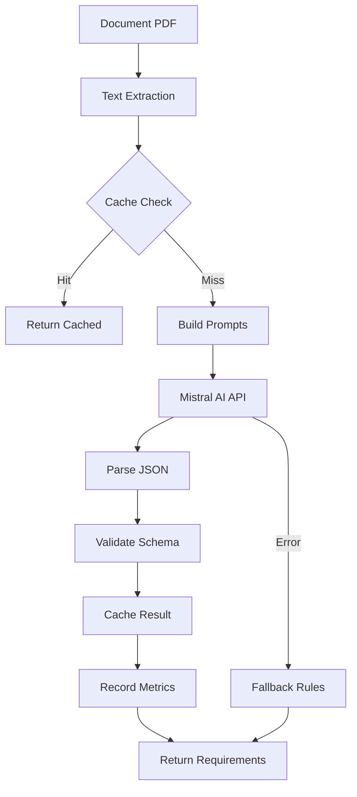

# 🤖 Extraction IA des Requirements - Documentation

## Vue d'ensemble

L'extraction automatique des requirements utilise **Mistral AI** pour analyser les documents de marchés publics français et extraire de manière structurée toutes les exigences.

## Architecture



## Configuration

### Variables d'Environnement

```bash
# API Keys
MISTRAL_API_KEY=your-mistral-api-key-here

# Configuration AI
ENABLE_AI_EXTRACTION=true
AI_EXTRACTION_CACHE_TTL=604800  # 7 jours
AI_EXTRACTION_MAX_TOKENS=4000
AI_EXTRACTION_TEMPERATURE=0.1
AI_EXTRACTION_TIMEOUT=30

# Redis Cache (optionnel mais recommandé)
REDIS_URL=redis://localhost:6379/0

# Limites de Sécurité
MAX_DOCUMENT_SIZE_FOR_AI=50000  # caractères
MAX_REQUIREMENTS_PER_DOCUMENT=100
MIN_CONFIDENCE_THRESHOLD=0.3
```

### Configuration dans le Code

```python
# src/core/config.py
class Settings(BaseSettings):
    # AI Configuration
    MISTRAL_API_KEY: str = Field(None, env="MISTRAL_API_KEY")
    ENABLE_AI_EXTRACTION: bool = Field(True, env="ENABLE_AI_EXTRACTION")

    # Redis
    REDIS_URL: str = Field("redis://localhost:6379/0", env="REDIS_URL")
```

## Utilisation

### Via l'API REST

```bash
# Analyser un tender avec ses documents
POST /api/v1/tenders/{tender_id}/analyze
Authorization: Bearer YOUR_JWT_TOKEN

# Réponse
{
    "success": true,
    "global_analysis": {
        "tender_id": "...",
        "document_count": 3,
        "matching_score": 85.5,
        "global_requirements": {
            "mandatory_requirements": [...],
            "optional_requirements": [...],
            "categories": {...}
        }
    }
}
```

### Via Python Direct

```python
from src.services.tender_analysis_service import TenderAnalysisService
from src.models.document_type import DocumentType

# Créer le service
service = TenderAnalysisService(db_session)

# Extraire les requirements d'un document
document = await document_repo.get_by_id(document_id)
result = await service._extract_requirements_with_ai(
    document,
    DocumentType.CCTP,
    tenant_id
)

# Résultat
print(f"Extracted {len(result['requirements'])} requirements")
print(f"Confidence: {result['confidence_avg']}")
```

## Format de Sortie

### Structure d'un Requirement

```json
{
    "category": "technical",
    "description": "Application web responsive compatible tous navigateurs",
    "importance": "high",
    "is_mandatory": true,
    "confidence": 0.92,
    "source_text": "L'application devra être développée en mode responsive...",
    "keywords": ["responsive", "web", "navigateurs"]
}
```

### Catégories Disponibles

- **technical** : Exigences techniques (architecture, performance, etc.)
- **administrative** : Documents administratifs, attestations
- **financial** : Aspects financiers, garanties, paiements
- **legal** : Clauses juridiques, responsabilités
- **functional** : Fonctionnalités métier
- **performance** : Critères de performance

### Niveaux d'Importance

- **critical** : Éliminatoire si non respecté
- **high** : Très important pour la sélection
- **medium** : Important mais pas critique
- **low** : Souhaitable mais optionnel

## Prompts Spécialisés par Type de Document

### CCTP (Cahier des Clauses Techniques Particulières)

Focus sur :
- Spécifications techniques détaillées
- Performances attendues
- Normes et standards
- Livrables techniques
- Architecture et infrastructure

### CCAP (Cahier des Clauses Administratives Particulières)

Focus sur :
- Clauses de paiement
- Pénalités de retard
- Garanties exigées
- Responsabilités contractuelles
- Conditions de résiliation

### RC (Règlement de Consultation)

Focus sur :
- Documents à fournir
- Critères d'évaluation
- Références requises
- Qualifications professionnelles
- Dates limites

### BPU (Bordereau des Prix Unitaires)

Focus sur :
- Structure de prix
- Unités de facturation
- Conditions de révision des prix
- Modalités de paiement

## Métriques et Monitoring

### Métriques Disponibles

```python
from src.services.ai.extraction_metrics import get_extraction_monitor

monitor = get_extraction_monitor()
stats = monitor.get_stats()

print(f"Total extractions: {stats['total_extractions']}")
print(f"Average processing time: {stats['avg_processing_time_ms']}ms")
print(f"Cache hit rate: {stats['cache_hit_rate']:.2%}")
print(f"Error rate: {stats['error_rate']:.2%}")
```

### Analyse des Coûts

```python
costs = monitor.get_cost_analysis()

print(f"Total cost: ${costs['total_cost_usd']:.2f}")
print(f"Savings from cache: ${costs['savings_from_cache_usd']:.2f}")
print(f"Cost per document: ${costs['avg_cost_per_document']:.3f}")
```

## Cache Redis

### Gestion du Cache

```python
from src.services.ai.requirements_cache import get_requirements_cache

cache = await get_requirements_cache(redis_url)

# Invalider un document
await cache.invalidate(document_id)

# Invalider tous les documents
await cache.invalidate_pattern("requirements:extraction:*")

# Statistiques
stats = await cache.get_stats()
print(f"Cache keys: {stats['keys_count']}")
print(f"Memory used: {stats['memory_used']}")
```

## Fallback et Gestion d'Erreurs

Le système dispose de 3 niveaux de fallback :

1. **Cache** : Si disponible, utilise les résultats en cache
2. **Règles** : Si l'IA échoue, utilise l'extraction par patterns
3. **Minimal** : En dernier recours, extraction minimale

```python
# Ordre de priorité
1. Cache (0ms, gratuit)
2. Mistral AI (3-5s, ~0.05€)
3. Extraction par règles (100ms, gratuit)
4. Extraction minimale (10ms, gratuit)
```

## Performance

### Temps de Traitement Moyens

| Type de Document | Temps Moyen | Cache Hit | Coût |
|-----------------|-------------|-----------|------|
| CCTP | 3-5s | 70% | 0.05€ |
| CCAP | 2-4s | 75% | 0.04€ |
| RC | 2-3s | 80% | 0.03€ |
| BPU | 1-2s | 85% | 0.02€ |

### Optimisations

1. **Chunking** : Documents >10K caractères sont tronqués
2. **Cache** : TTL de 7 jours par défaut
3. **Batch** : Traitement parallèle des documents
4. **Temperature** : 0.1 pour des résultats déterministes

## Troubleshooting

### Problèmes Courants

#### 1. "Mistral API key not configured"
```bash
export MISTRAL_API_KEY=your-key-here
```

#### 2. "Cache connection failed"
```bash
# Vérifier Redis
redis-cli ping
# Doit retourner PONG
```

#### 3. "JSON parsing failed"
- Vérifier les logs pour la réponse brute
- Augmenter `AI_EXTRACTION_MAX_TOKENS` si tronqué

#### 4. "Low confidence extraction"
- Document mal scanné ou de mauvaise qualité
- Type de document non reconnu
- Langue non française

## Scripts Utiles

### Retraiter les Documents Existants

```python
#!/usr/bin/env python
"""Reprocess existing documents with AI"""

import asyncio
from src.db.session import get_db
from src.services.tender_analysis_service import TenderAnalysisService

async def reprocess_all():
    async with get_db() as db:
        service = TenderAnalysisService(db)
        # ... code de retraitement

if __name__ == "__main__":
    asyncio.run(reprocess_all())
```

### Exporter les Métriques

```python
#!/usr/bin/env python
"""Export extraction metrics to CSV"""

from src.services.ai.extraction_metrics import get_extraction_monitor

monitor = get_extraction_monitor()
stats = monitor.get_stats()

# Export to CSV
import csv
with open('metrics.csv', 'w') as f:
    writer = csv.DictWriter(f, stats.keys())
    writer.writeheader()
    writer.writerow(stats)
```

## Exemples d'Intégration

### Frontend React

```javascript
// Appel API pour analyser un tender
const analyzeTender = async (tenderId) => {
    const response = await fetch(`/api/v1/tenders/${tenderId}/analyze`, {
        method: 'POST',
        headers: {
            'Authorization': `Bearer ${token}`,
            'Content-Type': 'application/json'
        }
    });

    const result = await response.json();

    if (result.success) {
        console.log(`Found ${result.global_requirements.total_requirements} requirements`);
        displayRequirements(result.global_requirements);
    }
};
```

### Webhook de Notification

```python
@app.post("/webhook/document-uploaded")
async def on_document_uploaded(
    document_id: UUID,
    db: AsyncSession = Depends(get_db)
):
    """Déclenche l'extraction automatique à l'upload"""

    service = TenderAnalysisService(db)
    tender = await service.get_tender_by_document(document_id)

    if tender:
        # Lancer l'analyse en arrière-plan
        background_tasks.add_task(
            service.analyze_tender_documents,
            tender.id
        )

    return {"status": "processing"}
```

## Support et Contact

- **Documentation API** : `/api/v1/docs`
- **Issues GitHub** : https://github.com/your-org/scorpius/issues
- **Email Support** : support@scorpiusproject.fr

## Changelog

### v1.0.0 (2024-01-30)
- ✅ Implémentation initiale avec Mistral AI
- ✅ Support des 4 types de documents (CCTP, CCAP, RC, BPU)
- ✅ Cache Redis avec TTL configurable
- ✅ Métriques et monitoring
- ✅ Fallback sur extraction par règles
- ✅ Tests unitaires complets