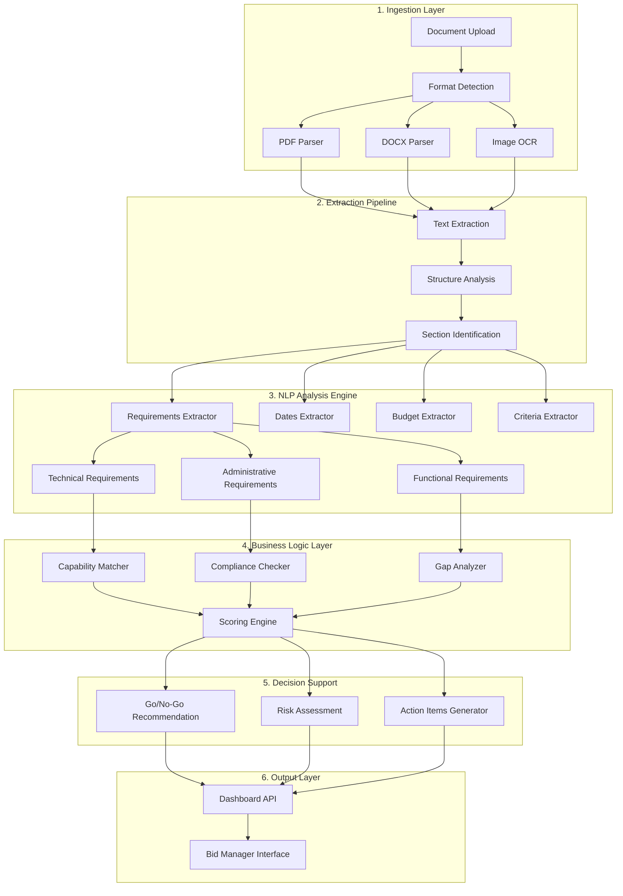

# Architecture d'Analyse des Documents pour Bid Management

## 🎯 Objectifs du Bid Manager

### Besoins Critiques
1. **Extraction rapide des informations clés**
   - Date limite de soumission
   - Budget estimé
   - Critères d'éligibilité
   - Critères d'évaluation et pondération

2. **Identification des requirements**
   - Exigences techniques obligatoires
   - Exigences administratives
   - Certifications requises
   - Références à fournir

3. **Analyse de faisabilité**
   - Match avec les capacités de l'entreprise
   - Identification des gaps
   - Estimation de l'effort requis

4. **Aide à la décision Go/No-Go**
   - Score de matching
   - Analyse des risques
   - ROI potentiel

## 📐 Architecture Proposée



## 🔧 Composants Techniques Détaillés

### 1. Document Processors

```python
# src/processors/document_analyzer.py

from abc import ABC, abstractmethod
from typing import Dict, List, Any
from dataclasses import dataclass
import re
from datetime import datetime

@dataclass
class ExtractedRequirement:
    """Requirement extrait d'un document"""
    category: str  # technique, administratif, fonctionnel
    description: str
    priority: str  # obligatoire, souhaitable, optionnel
    section_reference: str
    keywords: List[str]
    compliance_checkable: bool

@dataclass
class TenderMetadata:
    """Métadonnées extraites du tender"""
    reference: str
    title: str
    organization: str
    deadline: datetime
    budget_min: Optional[float]
    budget_max: Optional[float]
    evaluation_criteria: Dict[str, float]  # critère -> pondération
    submission_format: str
    language: str

class DocumentAnalyzer(ABC):
    """Interface pour les analyseurs de documents"""

    @abstractmethod
    async def extract_metadata(self, content: str) -> TenderMetadata:
        """Extraire les métadonnées du document"""
        pass

    @abstractmethod
    async def extract_requirements(self, content: str) -> List[ExtractedRequirement]:
        """Extraire tous les requirements"""
        pass

    @abstractmethod
    async def identify_sections(self, content: str) -> Dict[str, str]:
        """Identifier les sections du document"""
        pass
```

### 2. Requirements Extraction Engine

```python
# src/services/analysis/requirements_extractor.py

class RequirementsExtractor:
    """Extracteur intelligent de requirements"""

    def __init__(self):
        self.technical_patterns = [
            r"doit (?:être|avoir|posséder|fournir)",
            r"obligatoire(?:ment)?",
            r"exig(?:é|ence)",
            r"requis",
            r"nécessaire",
            r"impératif"
        ]

        self.technical_keywords = {
            "infrastructure": ["serveur", "cloud", "hébergement", "datacenter"],
            "développement": ["API", "framework", "language", "code"],
            "sécurité": ["chiffrement", "authentification", "RGPD", "ISO"],
            "performance": ["latence", "débit", "disponibilité", "SLA"]
        }

    async def extract_technical_requirements(self, text: str) -> List[ExtractedRequirement]:
        """Extraire les exigences techniques"""
        requirements = []
        sentences = self._split_sentences(text)

        for sentence in sentences:
            if self._is_requirement(sentence):
                requirement = self._parse_requirement(sentence)
                if requirement:
                    requirements.append(requirement)

        return requirements

    def _is_requirement(self, sentence: str) -> bool:
        """Détecter si une phrase contient une exigence"""
        sentence_lower = sentence.lower()
        return any(re.search(pattern, sentence_lower)
                  for pattern in self.technical_patterns)

    def _categorize_requirement(self, text: str) -> str:
        """Catégoriser une exigence"""
        text_lower = text.lower()

        for category, keywords in self.technical_keywords.items():
            if any(keyword in text_lower for keyword in keywords):
                return category

        return "general"
```

### 3. Capability Matching Engine

```python
# src/services/analysis/capability_matcher.py

from typing import List, Tuple
import numpy as np
from sklearn.feature_extraction.text import TfidfVectorizer
from sklearn.metrics.pairwise import cosine_similarity

class CapabilityMatcher:
    """Moteur de matching entre requirements et capacités"""

    def __init__(self):
        self.vectorizer = TfidfVectorizer(
            analyzer='word',
            ngram_range=(1, 3),
            max_features=1000
        )

    async def match_requirements_to_capabilities(
        self,
        requirements: List[ExtractedRequirement],
        company_capabilities: List[Dict[str, Any]]
    ) -> List[MatchResult]:
        """Matcher les requirements avec les capacités de l'entreprise"""

        matches = []

        for req in requirements:
            best_match = await self._find_best_capability_match(
                req, company_capabilities
            )

            matches.append(MatchResult(
                requirement=req,
                matched_capability=best_match[0] if best_match else None,
                confidence_score=best_match[1] if best_match else 0.0,
                gap_analysis=self._analyze_gap(req, best_match)
            ))

        return matches

    async def _find_best_capability_match(
        self,
        requirement: ExtractedRequirement,
        capabilities: List[Dict[str, Any]]
    ) -> Optional[Tuple[Dict, float]]:
        """Trouver la meilleure capacité correspondante"""

        if not capabilities:
            return None

        # Vectoriser le requirement
        req_text = f"{requirement.description} {' '.join(requirement.keywords)}"

        # Vectoriser les capacités
        cap_texts = [
            f"{cap['domain']} {' '.join(cap['technologies'])} {cap.get('description', '')}"
            for cap in capabilities
        ]

        # Calculer les similarités
        all_texts = [req_text] + cap_texts
        tfidf_matrix = self.vectorizer.fit_transform(all_texts)

        similarities = cosine_similarity(tfidf_matrix[0:1], tfidf_matrix[1:])[0]

        # Trouver le meilleur match
        best_idx = np.argmax(similarities)
        best_score = similarities[best_idx]

        if best_score > 0.3:  # Seuil de confiance
            return (capabilities[best_idx], best_score)

        return None

    def _analyze_gap(
        self,
        requirement: ExtractedRequirement,
        match: Optional[Tuple[Dict, float]]
    ) -> GapAnalysis:
        """Analyser les écarts entre requirement et capacité"""

        if not match or match[1] < 0.7:
            return GapAnalysis(
                has_gap=True,
                gap_type="capability_missing",
                remediation_needed=True,
                estimated_effort="high"
            )

        if match[1] < 0.9:
            return GapAnalysis(
                has_gap=True,
                gap_type="partial_match",
                remediation_needed=True,
                estimated_effort="medium"
            )

        return GapAnalysis(
            has_gap=False,
            gap_type=None,
            remediation_needed=False,
            estimated_effort="none"
        )
```

### 4. Scoring & Decision Engine

```python
# src/services/analysis/scoring_engine.py

class BidScoringEngine:
    """Moteur de scoring pour aide à la décision"""

    def __init__(self):
        self.weights = {
            'capability_match': 0.35,
            'compliance': 0.25,
            'experience': 0.20,
            'price_competitiveness': 0.15,
            'risk_level': 0.05
        }

    async def calculate_bid_score(
        self,
        tender_analysis: TenderAnalysis,
        company_profile: CompanyProfile,
        match_results: List[MatchResult]
    ) -> BidScore:
        """Calculer le score global de faisabilité"""

        # Score de matching des capacités
        capability_score = self._calculate_capability_score(match_results)

        # Score de conformité
        compliance_score = self._calculate_compliance_score(
            tender_analysis.requirements,
            company_profile
        )

        # Score d'expérience
        experience_score = self._calculate_experience_score(
            tender_analysis.domain,
            company_profile.references
        )

        # Score de compétitivité prix
        price_score = self._estimate_price_competitiveness(
            tender_analysis.budget,
            company_profile
        )

        # Score de risque
        risk_score = self._assess_risk_level(
            tender_analysis,
            match_results
        )

        # Score global pondéré
        global_score = (
            capability_score * self.weights['capability_match'] +
            compliance_score * self.weights['compliance'] +
            experience_score * self.weights['experience'] +
            price_score * self.weights['price_competitiveness'] +
            (1 - risk_score) * self.weights['risk_level']
        )

        # Recommandation Go/No-Go
        recommendation = self._generate_recommendation(
            global_score,
            capability_score,
            compliance_score
        )

        return BidScore(
            global_score=global_score,
            capability_score=capability_score,
            compliance_score=compliance_score,
            experience_score=experience_score,
            price_score=price_score,
            risk_score=risk_score,
            recommendation=recommendation,
            confidence_level=self._calculate_confidence(match_results)
        )

    def _generate_recommendation(
        self,
        global_score: float,
        capability_score: float,
        compliance_score: float
    ) -> str:
        """Générer une recommandation Go/No-Go"""

        if global_score >= 0.75 and compliance_score >= 0.8:
            return "GO - Forte probabilité de succès"

        if global_score >= 0.6 and capability_score >= 0.7:
            return "GO CONDITIONNEL - Nécessite des ajustements"

        if compliance_score < 0.5:
            return "NO-GO - Non-conformité critique"

        if global_score < 0.5:
            return "NO-GO - Faible probabilité de succès"

        return "ANALYSE APPROFONDIE REQUISE"
```

### 5. Action Items Generator

```python
# src/services/analysis/action_generator.py

class ActionItemsGenerator:
    """Générateur d'actions pour le bid manager"""

    async def generate_action_items(
        self,
        bid_score: BidScore,
        gap_analysis: List[GapAnalysis],
        deadline: datetime
    ) -> List[ActionItem]:
        """Générer la liste des actions à entreprendre"""

        actions = []

        # Actions pour les gaps critiques
        for gap in gap_analysis:
            if gap.has_gap and gap.gap_type == "capability_missing":
                actions.append(ActionItem(
                    priority="HIGH",
                    category="capability",
                    description=f"Acquérir ou développer: {gap.missing_capability}",
                    deadline=deadline - timedelta(days=30),
                    estimated_effort=gap.estimated_effort,
                    responsible="Technical Team"
                ))

        # Actions pour la conformité
        if bid_score.compliance_score < 0.8:
            actions.append(ActionItem(
                priority="CRITICAL",
                category="compliance",
                description="Obtenir les certifications manquantes",
                deadline=deadline - timedelta(days=45),
                estimated_effort="high",
                responsible="Legal/Compliance Team"
            ))

        # Actions pour les références
        if bid_score.experience_score < 0.6:
            actions.append(ActionItem(
                priority="MEDIUM",
                category="references",
                description="Identifier et documenter des projets similaires",
                deadline=deadline - timedelta(days=14),
                estimated_effort="medium",
                responsible="Business Development"
            ))

        # Trier par priorité et deadline
        actions.sort(key=lambda x: (x.priority_rank, x.deadline))

        return actions
```

## 🔄 Pipeline d'Intégration

### Phase 1: MVP Enhanced (2 semaines)
- Extraction basique des métadonnées
- Identification des requirements obligatoires
- Matching simple avec scoring basique

### Phase 2: NLP Integration (1 mois)
- Intégration Docling pour extraction avancée
- Classification automatique des requirements
- Analyse sémantique des critères

### Phase 3: ML-Powered (2 mois)
- Modèle de scoring entraîné sur historique
- Prédiction de taux de succès
- Recommandations personnalisées

### Phase 4: Intelligence Augmentée (3 mois)
- LLM pour génération de réponses
- Analyse comparative avec concurrents
- Optimisation automatique des propositions

## 📊 Métriques de Performance

### KPIs Techniques
- Temps d'analyse: < 30 secondes par document
- Précision extraction: > 90%
- Taux de faux positifs: < 5%

### KPIs Business
- Taux de Go corrects: > 80%
- Réduction temps d'analyse: -70%
- Amélioration taux de succès: +25%

## 🛠️ Stack Technique Recommandé

### Extraction & NLP
- **Docling**: Extraction de structure PDF
- **spaCy**: NLP français
- **Transformers**: CamemBERT pour contexte français

### Machine Learning
- **scikit-learn**: Matching et scoring
- **XGBoost**: Prédiction de succès
- **FAISS**: Recherche sémantique

### Infrastructure
- **Celery**: Processing asynchrone
- **MinIO**: Stockage documents
- **Elasticsearch**: Indexation full-text

## 🚀 Implémentation Prioritaire

1. **Sprint 1**: Requirements Extractor basique
2. **Sprint 2**: Capability Matcher
3. **Sprint 3**: Scoring Engine
4. **Sprint 4**: Dashboard bid manager
5. **Sprint 5**: Action Items Generator

Cette architecture permet une montée en charge progressive tout en délivrant de la valeur dès les premières itérations.