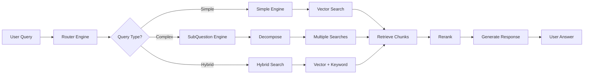

# RAG (Retrieval-Augmented Generation) Architecture

## Overview

The Scorpius Project implements a custom RAG system without LlamaIndex, using native APIs and PostgreSQL with pgvector for vector storage.

## Technology Stack

### Core Components
- **LLM/Embeddings**: Mistral AI (native SDK)
  - LLM Model: `mistral-large-latest`
  - Embedding Model: `mistral-embed` (1024 dimensions)
- **Vector Database**: PostgreSQL with pgvector extension
- **Search**: Hybrid approach (vector similarity + keyword matching)
- **Framework**: Custom Python implementation

## Architecture Components

### 1. Document Processing Pipeline

```
Document Upload → Processing → Chunking → Embedding → Storage → Indexing
```

#### Components:
- **Processors**: PyPDF2, Unstructured
- **Chunking Service**: Fixed-size, Semantic, Structural, Hybrid strategies
- **Embedding Service**: Batch processing with Mistral AI
- **Vector Store**: PostgreSQL with HNSW index

### 2. Services Architecture

```python
# Core Services (No LlamaIndex Dependencies)
src/services/ai/
├── mistral_service.py       # Native Mistral AI SDK integration
├── chunking_service.py      # Document chunking strategies
├── vector_store_service.py  # pgvector operations
├── query_engine.py          # Query processing engines
├── document_indexing.py     # Indexing pipeline
└── rag_integration.py       # RAG orchestration
```

### 3. Data Models

#### DocumentEmbedding Table
```sql
CREATE TABLE document_embeddings (
    id UUID PRIMARY KEY,
    document_id UUID REFERENCES procurement_documents(id),
    chunk_id VARCHAR(100) UNIQUE,
    chunk_text TEXT,
    embedding vector(1024),  -- pgvector column
    chunk_metadata JSONB,
    document_type VARCHAR(50),
    section_type VARCHAR(100),
    page_number INTEGER,
    chunk_index INTEGER,
    chunk_size INTEGER,
    overlap_size INTEGER,
    language VARCHAR(10),
    confidence_score FLOAT
);

-- HNSW Index for fast similarity search
CREATE INDEX idx_embeddings_hnsw 
ON document_embeddings 
USING hnsw (embedding vector_cosine_ops)
WITH (m = 16, ef_construction = 64);
```

## Query Processing

### Query Engines

1. **SimpleQueryEngine**
   - Direct vector similarity search
   - Single-pass retrieval
   - Best for straightforward questions

2. **SubQuestionQueryEngine**
   - Decomposes complex queries
   - Parallel sub-query processing
   - Aggregates results

3. **RouterQueryEngine**
   - Intelligent routing based on query type
   - Adaptive strategy selection
   - Optimal performance

### Query Flow



## API Endpoints

### RAG Operations

```http
POST /api/v1/rag/query
{
    "query": "string",
    "strategy": "simple|subquestion|router",
    "top_k": 5,
    "include_sources": true
}

POST /api/v1/rag/search
{
    "query": "string",
    "search_type": "vector|keyword|hybrid",
    "top_k": 10,
    "similarity_threshold": 0.7
}

GET /api/v1/rag/stats
# Returns indexing statistics and coverage

POST /api/v1/rag/feedback
{
    "query": "string",
    "response": "string",
    "feedback_type": "positive|negative",
    "rating": 5
}
```

## Implementation Details

### 1. Mistral AI Service (Native SDK)

```python
from mistralai import Mistral

class MistralAIService:
    def __init__(self):
        # Direct Mistral client - NO LlamaIndex
        self._client = Mistral(api_key=config["api_key"])
        
    async def generate_embedding(self, text: str):
        # Native API call
        response = await asyncio.to_thread(
            self._client.embeddings.create,
            model="mistral-embed",
            inputs=[text]
        )
        return response.data[0].embedding
        
    async def generate_completion(self, prompt: str):
        # Native chat completion
        response = await asyncio.to_thread(
            self._client.chat.complete,
            model="mistral-large-latest",
            messages=[{"role": "user", "content": prompt}]
        )
        return response.choices[0].message.content
```

### 2. Vector Store Operations

```python
class VectorStoreService:
    async def similarity_search(
        self,
        query_embedding: List[float],
        top_k: int = 5
    ):
        # PostgreSQL pgvector query
        query = """
            SELECT 
                chunk_id,
                chunk_text,
                1 - (embedding <=> %s::vector) as similarity
            FROM document_embeddings
            WHERE 1 - (embedding <=> %s::vector) > %s
            ORDER BY embedding <=> %s::vector
            LIMIT %s
        """
        return await self.execute(query, params)
```

### 3. Chunking Strategies

```python
class ChunkingService:
    strategies = {
        "fixed_size": FixedSizeChunker,
        "semantic": SemanticChunker,
        "structural": StructuralChunker,
        "hybrid": HybridChunker
    }
    
    async def chunk_document(self, text: str, strategy: str):
        chunker = self.strategies[strategy]()
        return await chunker.chunk(text)
```

## Performance Optimizations

1. **HNSW Index**: Fast approximate nearest neighbor search
2. **Batch Embeddings**: Process multiple chunks in parallel
3. **Query Cache**: Cache frequent queries with TTL
4. **Connection Pooling**: Reuse database connections
5. **Async Processing**: Non-blocking I/O operations

## Configuration

```python
# src/core/ai_config.py
class AIConfig:
    # Models
    embedding_model = "mistral-embed"
    llm_model = "mistral-large-latest"
    
    # Vector Store
    vector_dimension = 1024
    hnsw_m = 16
    hnsw_ef_construction = 64
    
    # Chunking
    chunk_size = 512
    chunk_overlap = 50
    
    # Query
    similarity_top_k = 5
    similarity_threshold = 0.7
```

## Benefits of Native Implementation

### Advantages over LlamaIndex
1. **No Dependency Issues**: Direct API calls, no version conflicts
2. **Full Control**: Complete visibility into operations
3. **Performance**: Reduced overhead, direct database queries
4. **Customization**: Tailored to French procurement documents
5. **Debugging**: Easier to trace and fix issues
6. **Cost Tracking**: Direct token usage monitoring

### Trade-offs
1. More code to maintain
2. Need to implement abstractions ourselves
3. No pre-built integrations

## Testing

### Integration Test
```bash
python test_rag_pipeline.py
```

Tests:
1. Document upload and processing
2. Chunk generation and embedding
3. Vector storage and indexing
4. Query processing (all strategies)
5. Hybrid search functionality
6. Performance metrics

## Monitoring

### Key Metrics
- Document indexing coverage
- Query response time
- Embedding generation rate
- Cache hit ratio
- Token usage and costs
- Search accuracy (via feedback)

## Future Enhancements

1. **Multi-lingual Support**: Beyond French
2. **Streaming Responses**: Real-time generation
3. **Fine-tuning**: Domain-specific models
4. **Advanced Reranking**: ML-based reranking
5. **Graph RAG**: Knowledge graph integration
6. **Conversational Memory**: Context retention