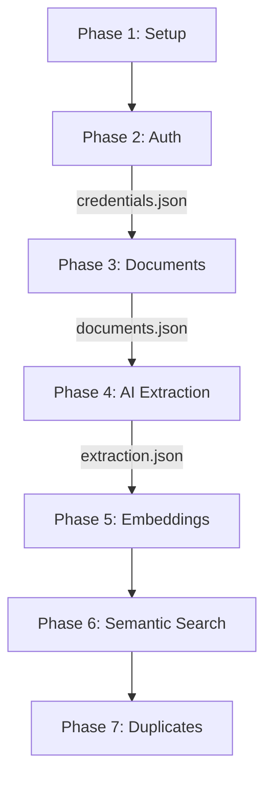

# Scorpius E2E Test Plan

## Overview

Comprehensive end-to-end test suite for the Scorpius procurement bid management system, covering all critical functionalities from authentication to AI-powered semantic search.

## Test Architecture

```
test_e2e_orchestrator.py (Main orchestrator)
    ├── test_e2e_setup.py        (Phase 1: Environment validation)
    ├── test_e2e_auth.py         (Phase 2: Authentication)
    ├── test_e2e_documents.py    (Phase 3: Document management)
    ├── test_e2e_ai_extraction.py (Phase 4: AI requirements extraction)
    ├── test_e2e_embeddings.py   (Phase 5: Vector embeddings)
    ├── test_e2e_semantic_search.py (Phase 6: Semantic search)
    └── test_e2e_duplicates.py   (Phase 7: Duplicate detection)
```

## Prerequisites

## Cleaner la bdd

  2. Identification de la base de données correcte

# Lister toutes les bases de données

  docker exec -i scorpius-db psql -U scorpius -d postgres -c "\l"

# Résultat : la base s'appelle "scorpius_mvp"

  3. Vérification des tables existantes

# Lister toutes les tables dans la base scorpius_mvp

  docker exec -i scorpius-db psql -U scorpius -d scorpius_mvp -c "\dt"

# Résultat : 14 tables dont procurement_tenders (pas "tenders")

  4. Nettoyage complet via SQL direct ✅

  docker exec -i scorpius-db psql -U scorpius -d scorpius_mvp << 'EOF'
  -- Désactiver les contraintes temporairement
  SET session_replication_role = 'replica';

  -- Vider toutes les tables
  TRUNCATE TABLE rag_feedback CASCADE;
  TRUNCATE TABLE query_cache CASCADE;
  TRUNCATE TABLE analysis_history CASCADE;
  TRUNCATE TABLE document_embeddings CASCADE;
  TRUNCATE TABLE processing_events CASCADE;
  TRUNCATE TABLE extracted_requirements CASCADE;
  TRUNCATE TABLE compliance_checks CASCADE;
  TRUNCATE TABLE capability_matches CASCADE;
  TRUNCATE TABLE bid_responses CASCADE;
  TRUNCATE TABLE procurement_documents CASCADE;
  TRUNCATE TABLE procurement_tenders CASCADE;
  TRUNCATE TABLE company_profiles CASCADE;
  TRUNCATE TABLE audit_logs CASCADE;
  TRUNCATE TABLE users CASCADE;

  -- Réactiver les contraintes
  SET session_replication_role = 'origin';

  -- Vérifier le résultat
  SELECT 'users' as table_name, COUNT(*) as count FROM users
  UNION ALL
  SELECT 'procurement_tenders', COUNT(*) FROM procurement_tenders
  UNION ALL
  SELECT 'procurement_documents', COUNT(*) FROM procurement_documents
  UNION ALL
  SELECT 'company_profiles', COUNT(*) FROM company_profiles
  UNION ALL
  SELECT 'audit_logs', COUNT(*) FROM audit_logs
  ORDER BY table_name;
  EOF
  
1. **Docker environment running**:

   ```bash
   docker-compose up -d
   ```

2. **Mistral API key configured** in `.env`:

   ```
   MISTRAL_API_KEY=wc9AxYy7BZeC5fKxlcj7nR7VN3f2XFVA
   ```

3. **Database initialized with pgvector**:

   ```bash
   docker-compose exec api python scripts/init_db_complete.py
   ```

## Running Tests

### Full Test Suite

```bash
cd scripts
python test_e2e_orchestrator.py
```

### Individual Phases

```bash
# Run specific phase
python test_e2e_auth.py
python test_e2e_documents.py
python test_e2e_ai_extraction.py
```

### Skip Specific Phases

```bash
python test_e2e_orchestrator.py --skip test_e2e_embeddings test_e2e_duplicates
```

### Quick Mode (future implementation)

```bash
python test_e2e_orchestrator.py --quick
```

## Test Phases

### Phase 1: Environment Setup (`test_e2e_setup.py`)

- ✅ API health check
- ✅ Database connectivity
- ✅ Redis connectivity
- ✅ Mistral AI configuration
- ✅ Sample document creation

**Output**: `/tmp/e2e_setup_status.json`

### Phase 2: Authentication (`test_e2e_auth.py`)

- ✅ User registration
- ✅ User login
- ✅ JWT token generation
- ✅ Profile retrieval (GET /me)
- ✅ Token refresh

**Output**: `/tmp/e2e_credentials.json`

### Phase 3: Document Upload (`test_e2e_documents.py`)

- ✅ Tender creation
- ✅ CCTP document upload
- ✅ RC document upload
- ✅ Processing status check
- ✅ Document listing
- ✅ Document download

**Output**: `/tmp/e2e_documents.json`

### Phase 4: AI Extraction (`test_e2e_ai_extraction.py`)

- ✅ Trigger AI analysis
- ✅ Analysis status monitoring
- ✅ Requirements extraction
- ✅ Requirement validation
- ✅ Category distribution
- ✅ Mandatory/optional classification

**Output**: `/tmp/e2e_ai_extraction.json`

### Phase 5: Embeddings (`test_e2e_embeddings.py`)

- ✅ Embeddings existence check
- ✅ Query embedding generation
- ✅ Similarity calculation
- ✅ Batch embedding generation
- ✅ Database storage verification
- ✅ Dimension consistency

**Output**: `/tmp/e2e_embeddings.json`

### Phase 6: Semantic Search (`test_e2e_semantic_search.py`)

- ✅ Basic semantic search
- ✅ Filtered search
- ✅ Similarity threshold validation
- ✅ Multi-language support
- ✅ Performance benchmarks (<200ms target)
- ✅ Result ranking quality
- ✅ Edge case handling

**Output**: `/tmp/e2e_semantic_search.json`

### Phase 7: Duplicate Detection (`test_e2e_duplicates.py`)

- ✅ Duplicate requirement detection
- ✅ Threshold sensitivity
- ✅ Similar tender finding
- ✅ Cross-document analysis
- ✅ Requirement clustering
- ✅ Duplicate impact analysis

**Output**: `/tmp/e2e_duplicates.json`

## Test Data Flow



## Success Criteria

### Critical Phases (Must Pass)

- Phase 1: Environment Setup
- Phase 2: Authentication

### Core Functionality (80% Pass Rate)

- Phase 3: Document Upload
- Phase 4: AI Extraction
- Phase 5: Embeddings

### Advanced Features (60% Pass Rate)

- Phase 6: Semantic Search
- Phase 7: Duplicate Detection

## Performance Targets

| Operation | Target | Acceptable |
|-----------|--------|------------|
| API Response | <200ms | <500ms |
| Document Upload | <5s | <10s |
| AI Extraction | <30s/doc | <60s/doc |
| Semantic Search | <200ms | <500ms |
| Embedding Generation | <1s | <2s |

## Output Files

1. **Logs**:
   - `e2e_test_YYYYMMDD_HHMMSS.log` - Complete test execution log

2. **Results**:
   - `e2e_test_results_YYYYMMDD_HHMMSS.json` - Detailed JSON report

3. **Temporary Data**:
   - `/tmp/e2e_*.json` - Inter-phase data transfer files

## Troubleshooting

### Common Issues

1. **Authentication fails**:

   ```bash
   # Check JWT configuration
   docker-compose exec api python -c "from src.core.config import settings; print(settings.SECRET_KEY)"
   ```

2. **Database connection issues**:

   ```bash
   # Verify PostgreSQL is running
   docker-compose ps postgres
   # Check pgvector extension
   docker-compose exec postgres psql -U scorpius -d scorpius_db -c "SELECT * FROM pg_extension WHERE extname='vector';"
   ```

3. **Mistral API errors**:

   ```bash
   # Verify API key
   docker-compose exec api python -c "from src.core.config import settings; print(settings.MISTRAL_API_KEY[:10] + '...')"
   ```

4. **Embedding dimension mismatch**:

   ```bash
   # Check embedding column dimension
   docker-compose exec postgres psql -U scorpius -d scorpius_db -c "\d extracted_requirements;"
   ```

## Monitoring Test Execution

### Real-time Log Viewing

```bash
tail -f e2e_test_*.log
```

### Check Phase Status

```bash
# View temporary files
ls -la /tmp/e2e_*.json
```

### Database Verification

```bash
# Count extracted requirements
docker-compose exec postgres psql -U scorpius -d scorpius_db -c "SELECT COUNT(*) FROM extracted_requirements;"

# Check embeddings
docker-compose exec postgres psql -U scorpius -d scorpius_db -c "SELECT COUNT(*) FROM extracted_requirements WHERE embedding IS NOT NULL;"
```

## Continuous Integration

### GitHub Actions Example

```yaml
name: E2E Tests
on: [push, pull_request]

jobs:
  test:
    runs-on: ubuntu-latest
    steps:
      - uses: actions/checkout@v2
      - name: Start services
        run: docker-compose up -d
      - name: Wait for services
        run: sleep 10
      - name: Run E2E tests
        run: docker-compose exec -T api python scripts/test_e2e_orchestrator.py
      - name: Upload results
        uses: actions/upload-artifact@v2
        with:
          name: test-results
          path: e2e_test_results_*.json
```

## Extension Points

### Adding New Test Phases

1. Create new test file: `test_e2e_newphase.py`
2. Follow the structure:

   ```python
   async def main():
       tester = NewPhaseTests()
       results = await tester.run_all_tests()
       return results
   ```

3. Add to orchestrator's `test_phases` list

### Custom Assertions

Add to test classes:

```python
def assert_response_time(self, response, max_ms=200):
    if response.elapsed.total_seconds() * 1000 > max_ms:
        logger.warning(f"Slow response: {response.elapsed.total_seconds()*1000:.2f}ms")
```

## Best Practices

1. **Idempotent Tests**: Each phase should be runnable independently
2. **Data Cleanup**: Tests should not leave residual data
3. **Clear Logging**: Use descriptive log messages with emojis for visual clarity
4. **Error Recovery**: Handle failures gracefully, don't stop entire suite
5. **Performance Tracking**: Monitor and log response times

## Contact

For issues or questions about the test suite:

- Check logs in `scripts/e2e_test_*.log`
- Review failed test details in `e2e_test_results_*.json`
- Consult the main documentation in `CLAUDE.md`
